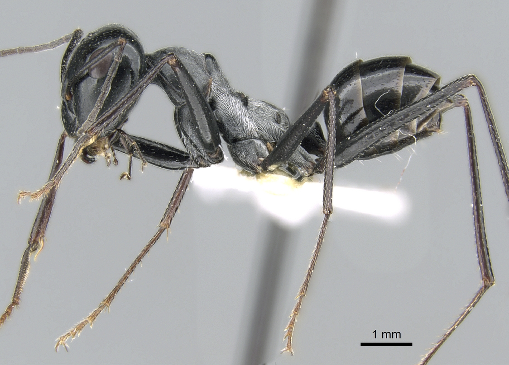

# Tools for Computational Biology Homework 1 
## Anish Mahadeo

## This folder contains: 
- Images of insects
- Python code 
- Spreadsheet of insect collection data from 2013 and 2014

Click [this link](Data/Survey_Data.xlsx) for the insect survey data

Click [this link](Source_code) for the source code

Here are images of the insects

## I asked my labmates about insects, here are the results

|Question| Yes | No | 
|---|---|---|
|Do you like spiders?| 1 | 6|
|Can you recite the script of bee movie?| 7 | 0|

